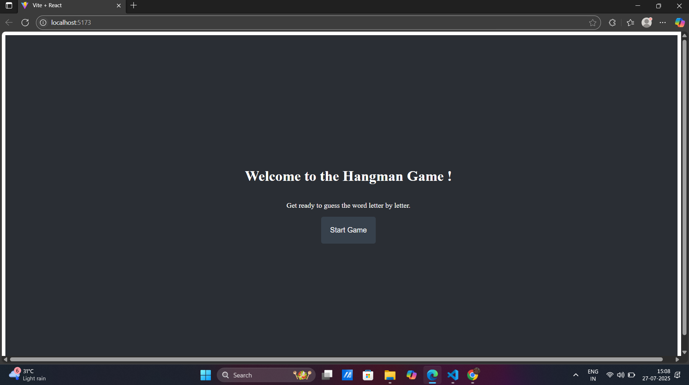
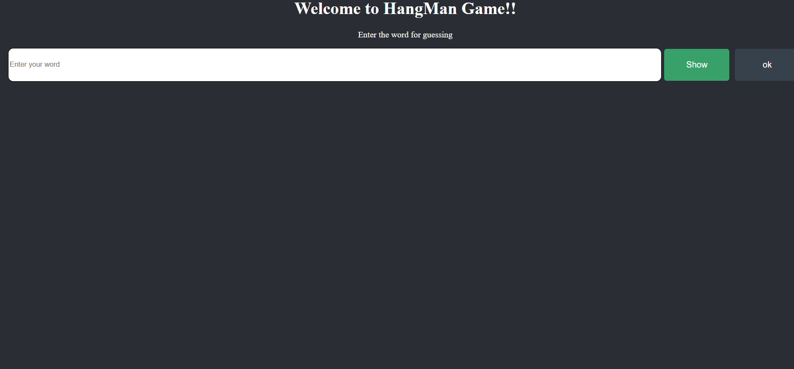
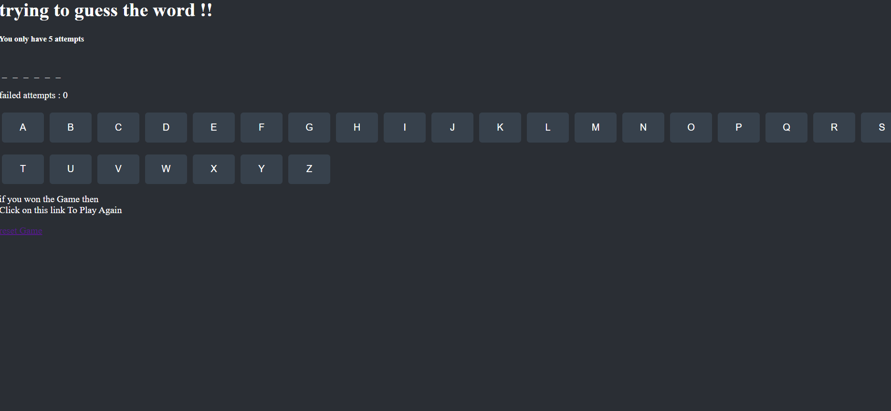
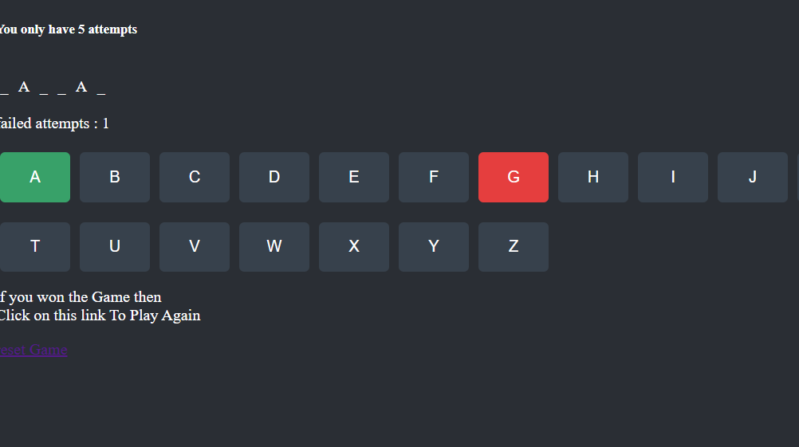
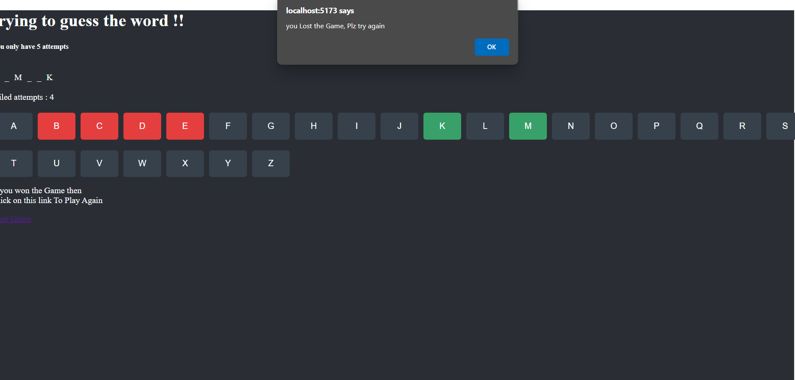

# Hangman Game

## Overview
Hangman is a classic word-guessing game built with React. The application features three main pages:

1. **Home Page:** Welcoming interface with a button to start the game.
2. **Start Game Page:** Input box to enter the word to be guessed.
3. **Play Game Page:** Interactive alphabet buttons for guessing letters.

## Features
- Enter a word to be guessed; it will be masked on the next page.
- Click alphabet buttons to guess letters. Correct guesses reveal the letter in the masked word.
- Correct guesses turn the button green; incorrect guesses turn it red.
- You have only 5 attempts. The attempt count is shown in the UI.
- If all attempts are used, a popup appears and you are redirected to the Start Game page.

## Installation
1. Clone the repository:
   ```bash
   git clone https://github.com/SamyakJain3/Hangman_Game.git
   ```
2. Navigate to the project folder:
   ```bash
   cd Hangman_Game
   ```
3. Install dependencies:
   ```bash
   npm install
   npm install react-router-dom
   ```
4. Start the development server:
   ```bash
   npm run dev
   ```

## Screenshots

### Home Page


### Start Game


### Play Game


### Right or Wrong Guess UI


### Game Lost Popup


## License
This project is open-source and available for modification and distribution.